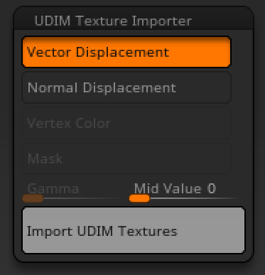

# UDIM Texture Importer for ZBrush

https://user-images.githubusercontent.com/7100231/226717384-3f47a9d0-e34f-4216-8190-48a2260320f9.mp4

## Notes:

**This plugin may still have bugs. Be sure to make a new save, create a new layer, and run it on that.**

## Getting Started

### Prerequisties

In addition to being a UDIM naming convention (eg. filename.1001.tif), textures must meet the following requrements.

For MacOS, you must install libtiff first. `brew install libtiff` 

#### Vector Displacement

* Tangent Vector
* 32bit tiff/exr or 16bit float-point exr
* Mid point 0.0
* **Flip and switch: 25 (ZBrush)**
* **Tangent Flip and switch: 25 (ZBrush)**
* **Absolute tangent (Mudbox)**

#### Normal Displacement
* 32bit tiff/exr or 16bit float-point exr
* Mid point 0.0

#### Color
* 8bit tiff/jpg/png or 16bit tiff

#### Mask
* 8bit or 16bit black/white tiff

### Installation

#### Windows10 & ZBrush2022
1. Go to [release page](https://github.com/minoue/UDIMTextureImporter/releases), download the latest and extract it.
2. Move tiff.dll to the same directory as ZBrush.exe. (eg. `C:\Program Files\Pixologic\ZBrush 2022\tiff.dll`) 
3. Move `UDIMTextureImporter_2022.zsc` to `ZPlugs64` folder.
4. Move `UDIMTextureImporterData` to `ZPlugs64` folder.

```
ZStartup/
├─ ZPlugs64/
│  ├─ UDIMTextureImporterData/
│  │  ├─ ZFileUtils/
│  │  │  ├─ ZFileUtils.dll
│  │  ├─ UDIMTextureImporter.dll
│  ├─ UDIMTextureImporter_2022.zsc
```

#### MacOS & ZBrush2022
coming soon

## Usage
Go to `ZPlugin` -> `UDIM Texture Importer`, and select the texture type you want to import.



*If your textures are sRGB and trying to import them as polypaint, set the gamma slider to 2.2*

## Known issues
Tiff images of zip compression type may not work properly for mask import on Windows. In that case, use LZW compression Tiff or use another format such as PNG.

## Roadmap
- [x] Vector Displacement
- [x] Normal Displacement
- [x] Color to polypaint
- [x] B/W mask
- [ ] Bump
- [ ] Additional image formats

## Build Instruction

### Requirements

* C++17
* [libtiff](http://www.libtiff.org)

For MacOS, you can use homebrew: `brew install libtiff`

For Windows, you may use a package manager such as Chocolatey or build from source code.

### How to build

```sh
git clone https://github.com/minoue/displacementImporter
cd displacementImporter
git submodule update --init --recursive
mkdir build
cd build
cmake -DCMAKE_BUILD_TYPE=Release ../
cmake --build . --config Release --target install
```

## License
[GPLv3](./LICENSE)

## Contact

`michitaka.inoue at icloud.com`


## Credits
This software uses the following libraries.

[tinyexr](https://github.com/syoyo/tinyexr) / The 3-Clause BSD License / Shoyo Fujita

[libtiff](http://www.libtiff.org) / LibTIFF license / Copyright © 1988-1997 Sam Leffler / Copyright © 1991-1997 Silicon Graphics, Inc.  

[FromZ](https://github.com/n-taka/FromZ) / GPLv3  / © Kazutaka Nakashima   

[Eigen](https://eigen.tuxfamily.org/) / MPL2 

[stb_image](https://github.com/nothings/stb) / [MIT License](https://github.com/nothings/stb/blob/master/LICENSE) / © 2017 Sean Barrett

