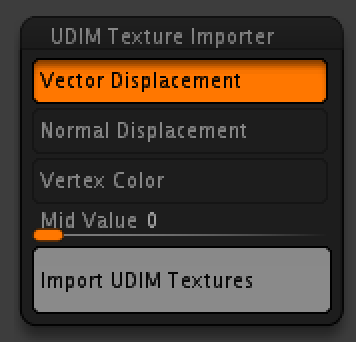

# UDIM Texture Importer for ZBrush

https://github.com/minoue/UDIMTextureImporter/assets/7100231/fbe57663-92da-47d2-b9c6-264a2953a150

## Notes:

**This plugin may still have bugs. Be sure to sve your tool first.**

## Getting Started

### Prerequisties

In addition to being a UDIM naming convention (eg. **filename.1001.tif**), **textures must meet the following requrements**.

For MacOS, you must install libtiff first. `brew install libtiff` 

#### Vector Displacement

* Tangent Vector
* 32bit tiff/exr or 16bit float-point exr
* Mid point 0.0
* **Flip and switch: 25 (ZBrush)**
* **Tangent Flip and switch: 25 (ZBrush)**
* **Absolute tangent (Mudbox)**

#### Normal Displacement
* 32bit or 16bit float-point EXR
* 8/16/32 bit tiff
* Mid point can be changed between 0-1

#### Color
* 8bit tiff/jpg/png or 16bit tiff
* **Limited support**
    * Tool loses UVs after importing color textures because of technical limitation, so you need to restore it manually.
        1. Switch to the lowest subdiv.
        2. Export obj as UV backup.
        3. Switch to the highest subdiv.
        4. Import color textures.
        5. Switch to the lowest subdiv.
        6. Import the obj file to restore UVs.

#### Supported tiff compression
* Deflate
* None
* LZW

### Installation

#### Windows10 & ZBrush2022
1. Go to [release page](https://github.com/minoue/UDIMTextureImporter/releases), download the latest and extract it.
2. Move `tiff.dll`, `zlib.dll`, and `libdeflate.dll` to the same directory as ZBrush.exe. (eg. `C:\Program Files\Pixologic\ZBrush 2022\tiff.dll`) 
3. Move `UDIMTextureImporter_2022.zsc` to `ZPlugs64` folder.
4. Move `UDIMTextureImporterData` to `ZPlugs64` folder.

```
ZStartup/
├─ ZPlugs64/
│  ├─ UDIMTextureImporterData/
│  │  ├─ ZFileUtils/
│  │  │  ├─ ZFileUtils.dll
│  │  ├─ UDIMTextureImporter.dll
│  ├─ UDIMTextureImporter_2022.zsc
```

#### MacOS & ZBrush2022
--

## Usage
Go to `ZPlugin` -> `UDIM Texture Importer`, and select the texture type you want to import.



## Build Instruction

### Requirements

* C++17
* [libtiff](http://www.libtiff.org)
* [zlib](https://www.zlib.net/) (optional for libtiff)
* [libdeflate](https://github.com/ebiggers/libdeflate) (optional for libtiff)

For MacOS, you can use homebrew: `brew install libtiff`

For Windows, you may use a package manager such as Chocolatey or build from source code.

### How to build

```sh
git clone https://github.com/minoue/UDIMTextureImporter
cd UDIMTextureImporter
git submodule update --init --recursive
mkdir build
cd build
cmake -DCMAKE_BUILD_TYPE=Release ../
cmake --build . --config Release --target install
```

## License
[GPLv3](./LICENSE)

## Contact

`michitaka.inoue at icloud.com`


## Credits
This software uses the following libraries.

[tinyexr](https://github.com/syoyo/tinyexr) / The 3-Clause BSD License / Shoyo Fujita <br>
[libtiff](http://www.libtiff.org) / LibTIFF license / Copyright © 1988-1997 Sam Leffler / Copyright © 1991-1997 Silicon Graphics, Inc. <br>
[zlib](https://www.zlib.net) / zlib License / © Jean-loup Gailly, Mark Adler <br>
[libdeflate](https://github.com/ebiggers/libdeflate) / MIT License / ©ebiggers <br>
[FromZ](https://github.com/n-taka/FromZ) / GPLv3  / © Kazutaka Nakashima <br>
[Eigen](https://eigen.tuxfamily.org/) / MPL2 <br>
[stb_image](https://github.com/nothings/stb) / [MIT License](https://github.com/nothings/stb/blob/master/LICENSE) / © 2017 Sean Barrett <br>

